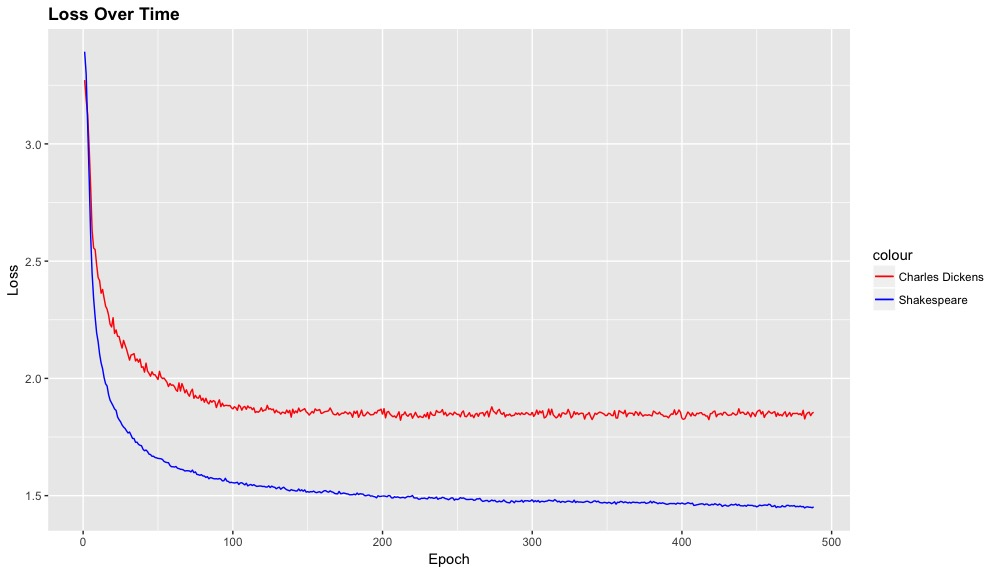
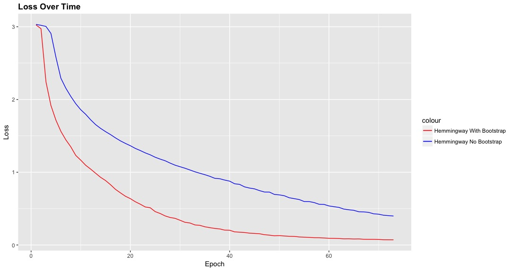
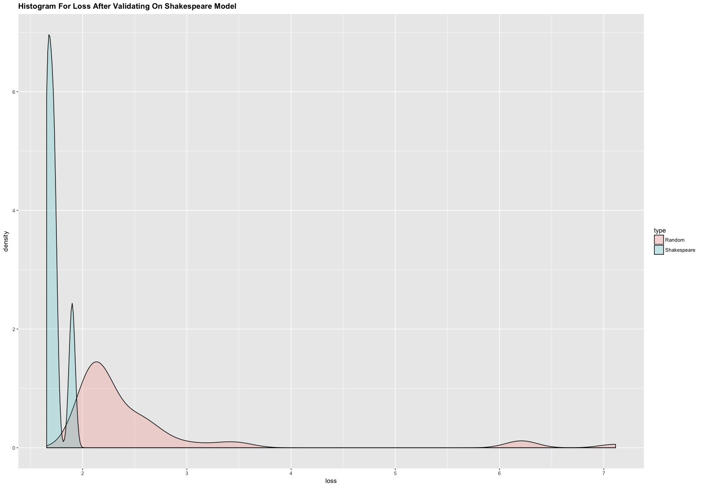

# I. Introduction

In recent years a lot of effort has gone into using machines to generating things humans usually have the biggest role in. This includes things such as ai generated art, text, speech and music. Some of these things have a strong sequential pattern. For example, if we have a sentence beginning with "The man walk across the \_\_\_\_\_", there are very few words that can fill that blank. The purpose of such artificial intelligence is to simply determine what comes next in the sequence as illustrated in figure 1, where \(w_1,...,w_m\) are observations in a time sequence:

\[ P(w_1,...,w_m) = \prod_{i=1}^{m} P(w_i \mid w_1,..., w_{i-1})  \]

Our goal is to train a model to be able to accurately predict what happens next given a sequence. This can not only be used in text generation, but also since we are able to assign a loss to each prediction. We assumption that during any human text writing process, due to our different background in writing, we each have our unique posterior word choice distribution given any previous words of a sentence or passage- if we feed-forward an article written by one author into a model trained on a different author, we should be able to see unusually high error rates. To illustrate the learning capabilities of an LSTM Neural Network we have a passages generated from models trained for different times on shakespeare text:

>  TITUS ANDRONICUS
ACT I
SCENE III	
An ante-chamber. The COUNT's palace.
[Enter CLEOMENES, with the Lord SAY]
Chamberlain: 
    Let me see your worshing in my hands.
Second Watchman:
    Ay, but we see them not at home: the strong and fair of thee,
    The seasons are as safe as the time will be a soul,
    That works out of this fearful sore of feather
    To tell her with a storm of something storms
    That have some men of man is now the subject.
    What says the story, well say we have said to thee,
    That shall she not, though that the way of hearts,
    We have seen his service that we may be sad.

# II. Bootstrap Training for Text Files

## II.1 Background on Recurrent Neural Networks

{ width=65% }

For this study we will use a recurrent neural network(RNN) as our model. A recurrent neural network is neural network in which the inputs from each node are fed back into itself a few times before a prediction is made. The figure above shows how the RNN network is unrolled. Here are the variable definitions:

  1. \(x_t\) is the input at time t
  2. \(U,V,W\) are weights that are trained. Note that U,V, and W are the same throughout the network unlike traditional neural networks which have different weight for each layer. This makes RNNs generally fast to train.
  3. \(s_t is\) the hidden stable at time t: \[s_t=f(Ux_t + Ws_{t-1}).\] It is the weighted sum of 
  4. \(o_t\) is the output vector, a vector of probabilities describing the prediction at time t for t+1

{ width=70% }

The type of RNN (Figure 2.) we will be using for this exercise is the LSTM (Long Short Term Memory) Neural Network. Without going into detail, each node in the LSTM has gates that allows it to forget things, explore new things, and remember events that happened in the distance past. For example, is you had to train on the sentences "Sam likes dogs. Sam really likes dogs. Dogs like Sam." A normal RNN may end up in an infinite loop such as "Sam likes dogs like sam likes dogs..." because it cannot realize that if sam was mentioned previously in the sentence he should not be next in the sequence. In Figure 3. we can see a model being trained on Shakespeare data but being validated on both Charles Dickens Data and Shakespeare Data. As the Neural Network learns, at first the two losses decrease at th same speed but the difference in style with Dickens and Shakespeare shows over time.

{ width=65% }

## II.2 Sequential Monte Carlo Sampling Bootstrap methods

In this next section we will use bootstrap methods to help our model train in a fast and efficient way. You might wonder, given Shakespeare's prolific history, don't' we have enough sample size? That might be the case, however Shakespeare has huge vocabulary size of 31,534. Which mean the average number of times we get to see any word is relatively small. In order to make an accurate prediction we must have a dataset that accounts for all of Shakespeare's vocabulary. We cannot use normal bootstrap methods because the random sample would cause incorrect sentences giving the model a bad signal so we design a sequential monte carlo sampling bootstrap method also know as a particle filter for a text sequence. This method is also useful for the text prediction for authors for which we do not have a large sample.

\[ \begin{array}{cccccccccc}
X_0&\to &X_1&\to &X_2&\to&X_3&\to &\cdots&\text{signal}\\
\downarrow&&\downarrow&&\downarrow&&\downarrow&&\cdots&\\
Y_0&&Y_1&&Y_2&&Y_3&&\cdots&\text{observation}
\end{array} \]

\[ {\displaystyle p(x_{0},\cdots ,x_{k}|y_{0},\cdots ,y_{k})={\frac {p(y_{0},\cdots ,y_{k}|x_{0},\cdots ,x_{k})p(x_{0},\cdots ,x_{k})}{p(y_{0},\cdots ,y_{k})}}} \]

Sequential monte carlo sampling works in a similar way to regular bootstrap methods. As seen in figure 4, this method is designed to estimate the true state of the data given noisy data. Supposed we have a sequence of observations: \(y_0,...,y_t\), in order to estimate the true state at time \[t\] defined as the most likely word one is likely to use at that time, we simulate this sequence using observations that occur in places similar to the current time. This of course is very hard to estimate with a limited dataset. Furthermore it is impossible to estimate the likelihood of a word if it has not occured before. For this method we make use of the word2vec algorithm, an model trained on large datasets from sources such as google news to be able to generate similar words in similar contexts. For example, a man would have a large cosine similarity to a woman and have a smaller cosine similarity to a cat. Word2Vec exactly describes the sampling method we need and even allows us to compensate for words we haven't seen. The method we used involves: 

  1. Step 1: First use a pre-trained word2vec model, and train it more on our smaller dataset.
  2. Step 2: Go through each word and substitute it for the word with the first or second most similar word with probably .3.
  3. Step 3: Repeat steps one through two but time select from the first best choice and second best choice with a different probability.
  4. Step 4: Repeat iterations N times until you have a satisfactory dataset.

##II.3 Example with Hemingway

Since Shakespeare is hard to read, hear is the bootstrap method run on some some Hemingway text:

> ORIGINAL TEXT: In the late summer of that year we lived in a house
in a village that looked across the river and the plain to
the mountains In the bed of the river there were peb
bles and boulders dry and white in the sun and the
water was clear and swiftly moving and blue in the
channels Troops went by the house and down the road
and the dust they raised powdered the leaves of the
trees The trunks of the trees too were dusty and the
leaves fell early that year and we saw the troops march
ing along the road and the dust rising and leaves stirred
by the breeze falling and the soldiers marching and

> BOOSTRAP WORD2VEC GENERATED: During this early spring of it month We resided in the houses
In the a town it seemed Across this creek and this pikestaff to
this mountain During this beds of this creek theresa are peb
tuo and boulder wet and black inthe this sunlight and this
potable water is crystal clear and quickly moved and red in this
channel Soldiers came by this houses and up this highway
and this dust particles we raising powders this leaving of this
tree This trunk of this tree so are desolate and this
leaving tumbled late it month and We noticed this soldiers marching

## II.3Results

As we can see in the graph below the bootstrap method greatly helped us achieve a lower loss given the same number of epochs. The Loss declined twice as fast during the same number of epochs and ended up at .07 compared to .4

{ width=70% }

\newpage

# III Confidence Interval Estimate for Authorship

With our trained model we try to estimate a confidence interval for shakespearean works. We first download 100 classical texts including the Declaration of Independence and "A Christmas Carol" and run them through a model trained  with 100 epoches on Shakespearean works. We then create an estimated distribution of losses using those values. We then take a simple jackknife estimate of loss by taking the loss on each play by training 100 epochs on each of the other plays per iteration. Below is a histogram of the estimated loss distributions of Shakespearean plays and random texts.
The estimated prediction interval for works random works that are not by shakespeare is about (1.76 ,3.51). Of the Shakespearean plays analyzed, two plays come close to this interval- A collection of Shakespeare's Sonnets (1.89) and the tempest(1.73). The Sonnets may have a high loss due to its irregular format, but there could weak evidence that that Shakespeare may have collaborated with someone for that work since the rest of the values cluster tightly around 1.6 loss.

{ width=55% }

# IV Conclusion

Although we did not find any significant evident that Shakespeare was actually multiple people, we did find some evidence of irregularities among his plays. Furthermore because of time constraints and computational limits we were not able to test a great sample size. We believe that these methods could be used for generalize the distinction between authors and future work will include a deeper look into how style and themes are represented.

